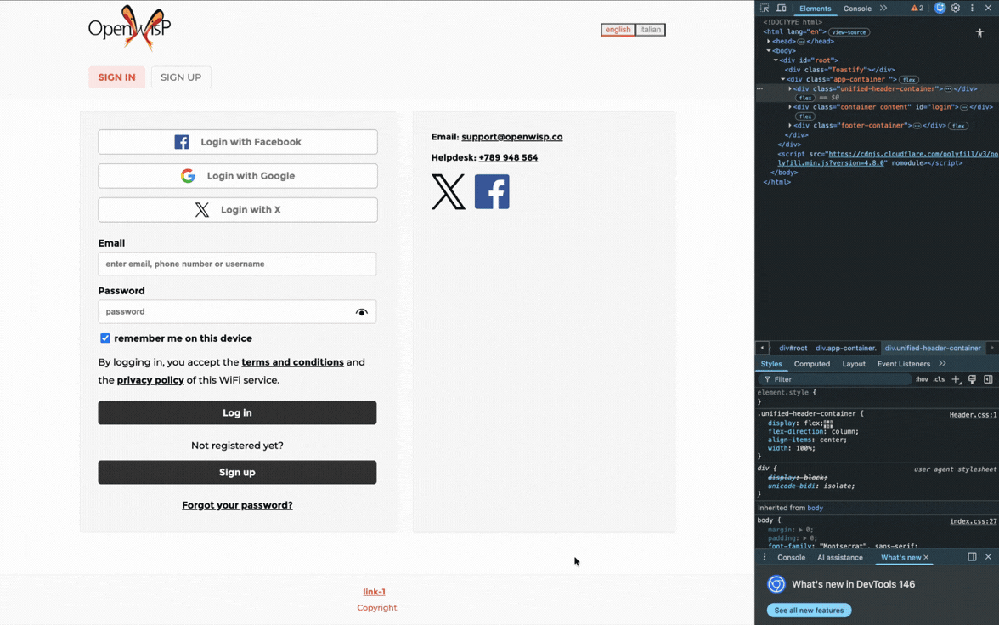
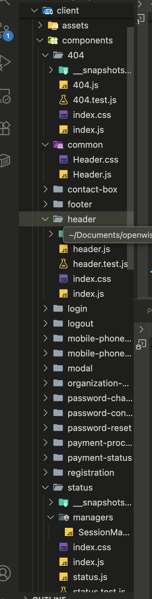
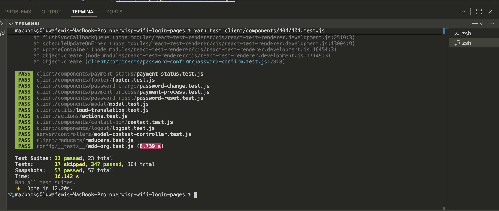

# GSoC Prototype: WiFi Login Pages Modernization

This repository branch (`gsoc-wifi-login-pages-prototype`) is a **focused, partial prototype** demonstrating the key implementation approaches for the "WiFi Login Pages Modernization" Google Summer of Code project.

It is purposefully not a complete implementation or full refactor. Instead, it provides concrete examples of the proposed architectural changes and modernizations to prove understanding of the OpenWISP codebase and the feasibility of the proposal.

## What is included

The prototype focuses on exactly three core improvements outlined in the project proposal:

### 1. Status Component Modular Structure (Partial Refactor)
*The `Status` component (`client/components/status/status.js`) had grown complex as it handled API requests, logic, and rendering.*
* **What was done:** Isolated API and logic calls into an external manager. Created `client/components/status/managers/SessionManager.js` to handle `getUserRadiusSessions` and `getUserRadiusUsage` functionality.
* **Why it matters:** This demonstrates the strategy for safely shrinking `status.js` logic and injecting modular testable managers without breaking the heavy legacy flow of the component itself. It simplifies maintenance significantly.

### 2. Unified Header Component
*The legacy header duplicated its DOM implementation into `.header-desktop` and `.header-mobile`.*
* **What was done:** Created `client/components/common/Header.js`. It consolidates the duplicated markup into a single source of truth by utilizing modern Flexbox behavior and a cleaner `@media` query configuration. The original `header.js` simply re-exports this unified piece to immediately ensure non-breaking backwards compatibility.
* **Why it matters:** UI customizations (like branding) no longer need to be applied twice. 

### 3. Migration Example to React Testing Library (RTL)
*Upgrading to React 19 requires moving away from the deprecated `Enzyme` test suite.*
* **What was done:** Bootstrapped `@testing-library/react` and completely rewrote `client/components/404/404.test.js` using modern `render` and `screen` patterns instead of Enzyme’s `shallow` wrappers. 
* **Why it matters:** Provides a working template for the full migration effort later and verifies RTL plays cleanly with the current local storage / config mock setup.

### 4. Captive Portal API Design (RFC 8908)
*Modern captive portals can expose standard states (internet, portal, unknown).*
* **What was done:** I defined a complete design for how Captive Portal detection should work, including feature flags, per-org config, timeout behavior, fallback semantics, and diagram/implementation plan. (A minimal proof diagram is included in the design documentation.)
* **Why it matters:** This confirms the project is ready for implementation during the summer and ensures behavior remains safe for legacy deployments.

---

## Notes (What is NOT implemented)

Since this is a minimum viable prototype, several complete project deliverables were intentionally skipped to keep the review small and fast:
- **Full React 19 Upgrade:** Upgrading effectively requires extensive changes to Webpack, Node engines, and dependencies. The codebase remains on its current React version for the sake of standardizing the RTL tests first.
- **RTL rewrite of `header.test.js`:** The header snapshot and structural tests have been intentionally skipped (`xdescribe`) to avoid unnecessary yak-shaving since the DOM drastically changed during the unified header refactor. Those tests would be entirely rewritten in the real task.
- **Complete refactoring of the Status page:** Only session management was moved. Authentication tracking, Captive Portal intercepts, and WebSockets logic still reside in the container.
- **Captive-portal API Support:** The actual implementation of RFC 8908 is not included here. 

---

## Demo

Here is a visual overview of the prototype changes.

### 1. Unified Header Refactor
*Testing the single unified HTML payload utilizing CSS Flexbox versus the previously hard-coded duplicates.*


### 2. Status Manager Extraction
*Extracting API requests (`getUserRadiusSessions`, etc.) out of the massive `Status.js` component and into isolated, testable managers.*


### 3. RTL Migration Example
*Locally running the newly migrated `404.test.js` using `@testing-library/react` and `@testing-library/jest-dom`.*


---

## How to proceed

1. **Verify the implementation:** 
   ```bash
   yarn
   yarn setup
   yarn start
   ```
2. **Examine the test suite:**
   ```bash
   # Run the newly minted React Testing Library test:
   yarn test client/components/404/404.test.js
   ```

3. Please review the specific commits corresponding to the prototype for a granular view of the code restructuring.

### 5. Full feature list with status
1. Refactor Status Component
   - [refactor] Simplify status component logic #918
2. Eliminate Redundancy of Header HTML
   - [refactor] Eliminate redundancy of header HTML #314 (implemented)
3. React Testing Library Migration Example
   - [upgrade] React 19 migration #870 (implemented)
4. Move redirect logic from OrganizationWrapper to components
   - [refactor] Move redirect logic from OrganizationWrapper #272 (design/proposed)
5. Add Support for Captive Portal API
   - [feature] Add support for captive-portal API #947 (design/proposed)